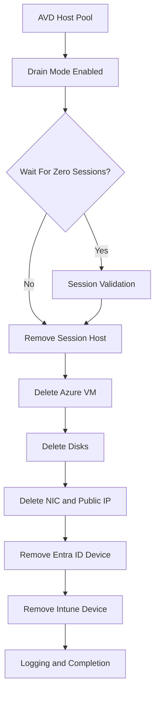

## 📊 Architecture Flow

# 🚀 AVD Host Decommission Framework

Secure, structured and complete Azure Virtual Desktop host lifecycle cleanup for enterprise environments.

# 📌 Executive Summary

Improper AVD host decommissioning creates:

Operational risk

Security exposure

Cost leakage

Lifecycle drift

Orphaned disks, stale NICs, lingering Entra ID devices, and unmanaged Intune records accumulate over time.

This framework provides a controlled, logged and safety-driven lifecycle removal process for Azure Virtual Desktop session hosts.

# ✅ What This Framework Covers

Drain mode activation (AllowNewSession = $false)

Optional zero-session validation

Remove session host from AVD host pool

Azure VM deletion

OS & data disk cleanup

NIC cleanup

Public IP cleanup

Optional safe NSG cleanup (if unused)

Entra ID device removal

Intune managed device removal

Bulk mode (CSV / TXT)

Structured logging

Dry-run safety model (default)

# 🛡 Safety Model

By default, the framework runs in DRY RUN (WhatIf mode).

No deletion occurs unless the -Execute switch is specified.

Additional safeguards:

SupportsShouldProcess

ConfirmImpact = High

Optional zero-session wait validation

Comprehensive logging

Best-effort module loading

# 🔄 Architecture Flow

Identify AVD Host Pool

Enable Drain Mode

Validate Zero Sessions (optional)

Remove Session Host

Delete Azure VM

Delete Disks & Networking

Remove Entra ID Device

Remove Intune Managed Device

# 📂 Example Usage

# 🧪 Dry Run (Safe Mode)
.\Remove-AvdHostsFully.ps1 `
-SubscriptionId "<SubscriptionId>" `
-AvdResourceGroup "RG-AVD" `
-HostPoolName "PROD-POOL" `
-VmNames @("AVD-01","AVD-02")

# 🔥 Execute Mode (Actual Deletion)

.\Remove-AvdHostsFully.ps1 `
-SubscriptionId "<SubscriptionId>" `
-AvdResourceGroup "RG-AVD" `
-HostPoolName "PROD-POOL" `
-VmNames @("AVD-01","AVD-02") `
-Execute

# 📦 Bulk Mode (CSV)

CSV must contain a column named:

VmName

.\Remove-AvdHostsFully.ps1 `
-SubscriptionId "<SubscriptionId>" `
-AvdResourceGroup "RG-AVD" `
-HostPoolName "PROD-POOL" `
-BulkFile ".\hosts.csv" `
-Execute

# 📝 Logging

Default log path:

C:\Temp\AVD-Cleanup\Remove-AvdHostsFully.log

# 🛠 Requirements

Modules (auto-installed if possible):

Az.Accounts

Az.Compute

Az.Network

Az.DesktopVirtualization

Microsoft.Graph

Permissions required:

Azure Contributor (or higher)

Intune Device Management

Entra Device.ReadWrite.All

# 🔮 Roadmap

Pre-deletion RBAC validation

Multi-resource-group support

Azure Automation Account integration

CI/CD pipeline integration

Reporting-only mode

API-driven version

# ⚠ Enterprise Disclaimer

This framework performs high-impact lifecycle operations.

It is intended for experienced Azure administrators and should be tested in controlled environments prior to production use.

The author assumes no responsibility for misuse or misconfiguration.
